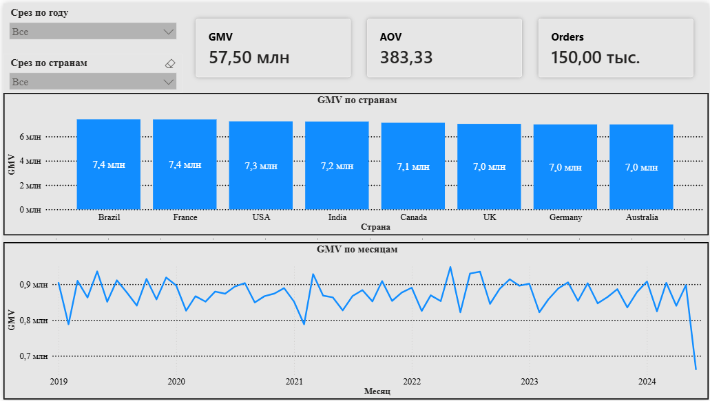
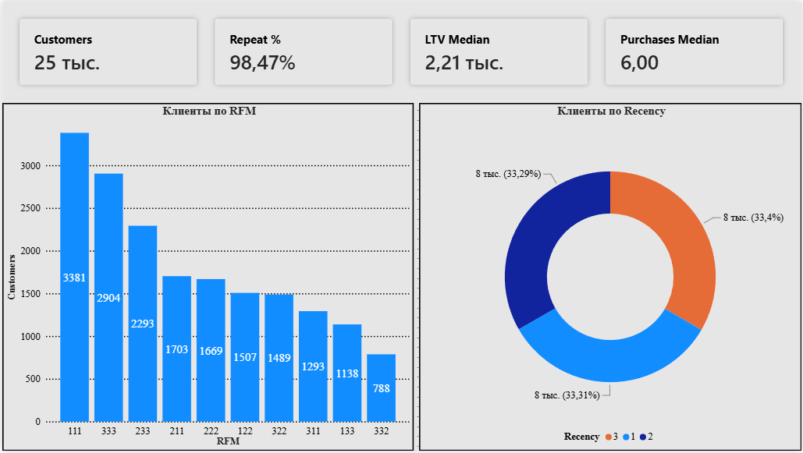
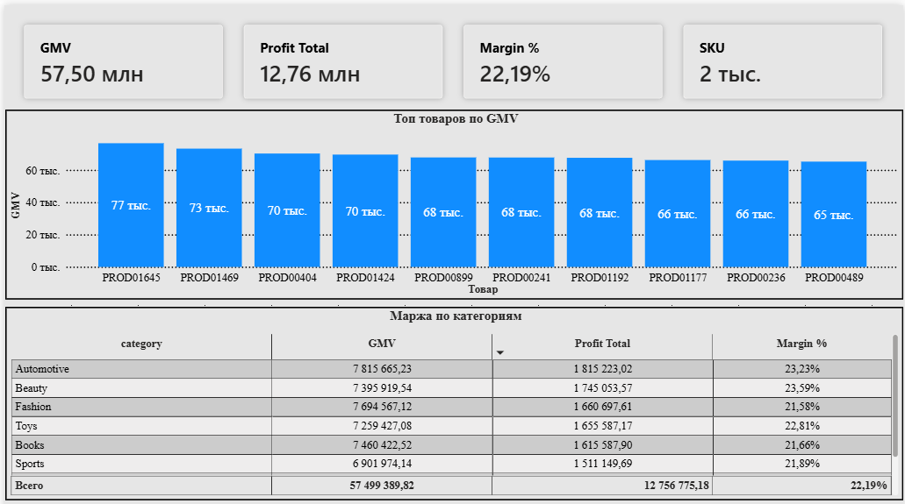
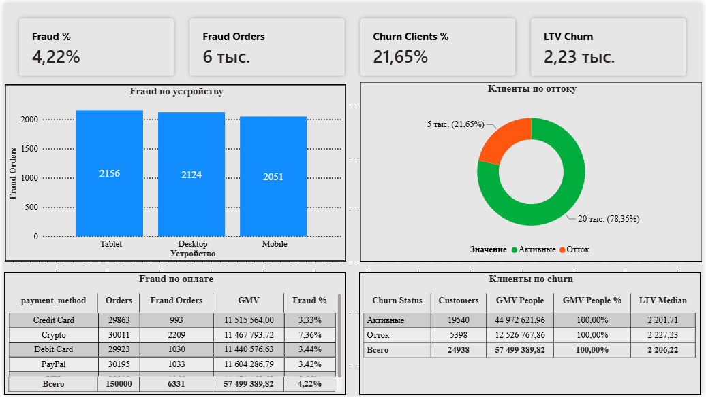

# Enterprise Eсommerce

Пет-проект: e-commerce аналитика от CSV до дашборда Power BI + ML.  
Датасет: https://www.kaggle.com/datasets/jayjoshi37/enterprise-e-commerce-intelligence  
Период: **январь 2019 — 23 июня 2024** (последний месяц обрезан).

Python → MySQL → Power BI. Метрики сверены между слоями.  
ML (классификация): отток клиента и фрод заказа.

---

## О чём проект

| Слой | Что делает |
|------|------------|
| **Python** | ETL нескольких CSV, join dims, people, parquet, KPI |
| **SQL (MySQL)** | схема, load, sanity, KPI-запросы |
| **Power BI** | дашборд, 4 страницы |
| **ML** | churn и fraud: логрег vs random forest |

**Маршрут: продажи + клиенты + продукт (A+B+C), плюс срезы fraud / churn**
- **A — GMV, AOV, country, год×месяц**
- **B — repeat, LTV, когорты, retention, RFM, churn_label**
- **C — маржа, топ SKU, категории**
+ **fraud_label** (заказ), **churn_label** (клиент)

**Метрики:** GMV = `SUM(order_value)`, orders = `COUNT(DISTINCT order_key)`, AOV = GMV / orders.  
Маржа: прибыль строки = `order_value * margin_percentage / 100`, затем `SUM(profit) / SUM(GMV)`.

**Зерно:** колонка заказа есть (`transaction_id` = `order_key`). Строк ≈ заказов → grain = **order**.

---

## Данные и ETL

Четыре файла в `data/`:

| Файл | Роль | ~строк |
|------|------|--------|
| `transactions.csv` | факт (деньги, дата, fraud) | 150 000 |
| `customers.csv` | dim клиентов (country, churn_label) | 25 000 |
| `products.csv` | dim товаров (category, margin_percentage) | 2 000 |
| `behavior.csv` | dim поведения | ~25 000 |

**Чистка:** отмен нет; суммы ≥ 0; фильтр `money > 0` не нужен.  
После join: GMV не раздувается; в продажах **24 938** клиентов с заказами (остальные в справочнике без транзакций).

**Ключи:** `order_key` = `transaction_id`.  
**people:** 1 клиент = 1 строка (`gmv`, `orders` = nunique заказа, `first_order`).  
RFM (`segment`, `R`) дописывается из `report.py` в `people.parquet` и уходит в MySQL, хотел вывести в витрину.

---

## Ключевые находки

**Продажи**
- GMV **57 499 390**, заказов **150 000**, AOV **~383**
- Страны почти ровные: топ Brazil / France / USA (~7.4M / ~7.4M / ~7.3M) — сильной концентрации нет
- Пик месяца: **2022-05** (~0.95M GMV). Хвост **2024-06** ниже полного месяца — не сравнивать с полными

**Клиенты**
- **24 938** клиентов с покупками; заказов на человека min / median / max = **1 / 6 / 18**
- Repeat **98.5%**
- LTV median **~2 206**
- RFM: чемпионы **333** — 2 904 клиента (~12% людей, ~19% GMV); остывшие **R=1** — ~33% клиентов (~27% GMV)
- Отток `churn_label=1`: **~21.6%** клиентов и **~22%** GMV; LTV median почти как у активных (~2 227 vs ~2 202) — отток не «мелкие» клиенты

**Продукт**
- SKU **2 000**, прибыль **~12.76M**, маржа **~22.2%**
- Маржа по категориям почти ровная (~21–23%) — объём не равен «маржинальности»

**Fraud**
- **4.22%** заказов (6 331 строк)
- Crypto заметно выше остальных способов оплаты (~7.4% vs ~3.3–3.5% у карт / PayPal / UPI)

Цифры совпадают в `scripts/report.py`, SQL (`04`–`12`) и карточках Power BI.

---

## Дашборд

Готовый отчёт: `powerbi/Enterprise Ecommerce.pbix`

| Файл | Страница |
|------|----------|
| `powerbi/screenshots/overview.png` | Обзор |
| `powerbi/screenshots/customers.png` | Клиенты |
| `powerbi/screenshots/products.png` | Продукт |
| `powerbi/screenshots/fraud_churn.png` | Fraud и отток |

### Обзор


### Клиенты


### Продукт


### Fraud и отток


- **Обзор** — карточки GMV / Orders / AOV; линия по месяцам; GMV по странам; срезы год / страна
- **Клиенты** — Customers / Repeat % / LTV / покупок медиана; bar по RFM; donut по Recency
- **Продукт** — GMV / прибыль / маржа / SKU; топ товаров; таблица категорий
- **Fraud + churn** — доля fraud и оттока; устройство / оплата; клиенты по churn

---

## Pipeline

```text
data/transactions.csv (+ customers, products, behavior)
        │
        ├─► scripts/pipeline.py    → data/processed/clean.parquet, people.parquet
        ├─► scripts/report.py      → KPI A/B/C + fraud/churn; RFM в people.parquet
        ├─► scripts/load_mysql.py  → MySQL enterprise_ecommerce (+ profit, churn, segment)
        ├─► sql/01 … 12            → schema, sanity, keys, KPI
        ├─► powerbi/               → .pbix, screenshots
        └─► ml/churn | ml/fraud    → классификация
```

| Файл | Назначение |
|------|------------|
| `scripts/pipeline.py` | load 4 CSV, types, clean, keys, join, people, parquet |
| `scripts/report.py` | totals / country / year-month / repeat / retention / RFM / churn / margin / top / cat / fraud |
| `scripts/load_mysql.py` | parquet → MySQL |
| `sql/01_schema.sql` | БД `enterprise_ecommerce` |
| `sql/02`–`06` | sanity, keys, totals, country, year-month |
| `sql/07`–`09` | repeat, retention, RFM |
| `sql/10`–`12` | продукт, churn, fraud |

```text
python scripts/pipeline.py
python scripts/report.py
python scripts/load_mysql.py
python ml/churn/train.py
python ml/fraud/train.py
```

---

## Power BI — модель

- `clean_orders` + `people`
- связь: `people[customer_id]` (1) → `clean_orders[customer_id]` (*)
- `profit` считается при load: `order_value * margin_percentage / 100`
- RFM: колонки `people[segment]`, `people[R]`

```dax
GMV = SUM ( 'clean_orders'[order_value] )
Orders = DISTINCTCOUNT ( 'clean_orders'[order_key] )
AOV = DIVIDE ( [GMV], [Orders] )
Profit Total = SUM ( 'clean_orders'[profit] )
Margin % = DIVIDE ( [Profit Total], [GMV] )

Customers = COUNTROWS ( 'people' )
Repeat % = DIVIDE ( COUNTROWS ( FILTER ( 'people', 'people'[orders] >= 2 ) ), [Customers] )
LTV Median = MEDIAN ( 'people'[gmv] )

Fraud % = AVERAGE ( 'clean_orders'[fraud_label] )
```

---

## ML

Классификация: логрег и лес,  по  готовым меткам 0/1.  
Сравниваем **ROC-AUC** (кто лучше ранжирует риск) и **какую долю класса 1 поймали**. 

**Отток** — 1 клиент = 1 строка, метка `churn_label`, доля **21.6%**.  
Не в признаках: сама метка; `behavior_churn_signal` (почти копия оттока); `lifetime_value` (считается из тех же заказов).

| модель | ROC-AUC | поймали отток | accuracy |
|--------|---------|---------------|----------|
| логрег | 0.66 | 67% | 0.63 |
| лес | 0.66 | 24% | 0.74 |

AUC одинаковый. Лес выше accuracy, потому что чаще говорит «останется». Для задачи «найти уходящих» берём **логрег**. Главный признак — `loyalty_score` (выше лояльность → ниже шанс уйти); остальное слабое.

**Фрод** — 1 заказ = 1 строка, метка `fraud_label`, доля **4.22%**.  
Не в признаках: id, дата заказа, `churn_label` / LTV клиента.

| модель | ROC-AUC | поймали фрод | accuracy |
|--------|---------|--------------|----------|
| логрег | 0.64 | 56% | 0.64 |
| лес | 0.61 | ~0% | 0.96 |

Лес почти всех считает честными — accuracy 0.96 из‑за 4% фрода, для задачи бесполезен. В выводах **логрег**. Сильнее всего оплата **Crypto** (тот же срез, что на дашборде).

---

## Стек

Python (pandas, pyarrow, scikit-learn) → MySQL 8 → Power BI Desktop (DAX).

---

## Автор

@cat_main
